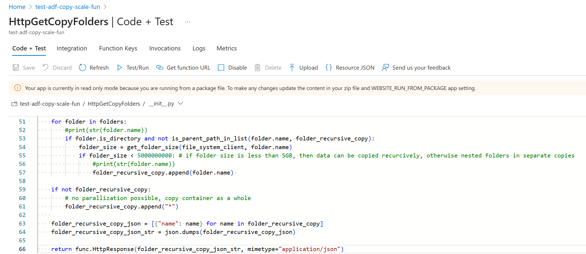

## Optimizing ADF Copy Performance for skewed Data Lakes
In this GitHub repo, two strategies are discussed to improve performance of data copying to and from Enterprise Data Lakes using Azure Storage. First strategy is applicable on Azure storage account in which data is evenly distributed, the second is applicable where data distribution is uneven. 

For the evenly distributed data lake, standard ADF functionality is used to build the copy pipeline. For the unevenly distributed data, an Azure Function is used to scan the data pockets and to make sure that copy activity are maximally parallized where the data is.

### 1. Deploy Data Facory

Run the script ```deploy_adf.ps1 ``` In case ADF is succesfully deployed, there are two pipelines deployed:


In the switch, it can be seen that an Azure Function is used when the parameter is set for an uneven distributed data lake. This Azure Function is deployed in the next step.

### 3. Deploy Azure Function

Run the following commands:

Run the script ```deploy_azurefunction.ps1 ``` In case ADF is successfully deployed, there are two pipelines deployed:



### 4. Conclusion

In this GitHub, two strategies are shown to improve copy performances in which a distinction is made between evenly distributed data and unevenly distributed data.

- Evenly Distributed Data: In case it is known on beforehand that data is evenly distributed, ADF's built-in functionalities such as recursive copy activities, For Each activities, and nested pipelines can be leveraged. 
  - Advantage is that solution is easy to setup and requires no coding. 
  - Disadvantage is that it requires the assumption that data is evenly distributed.

- Unevenly Distributed Data: For data distributions where some folders contain significantly more data, incorporating Azure Functions to dynamically identify and parallelize copy activities in data-heavy folders is essential. This strategy ensures that copy activities are focused where they are needed most, improving overall throughput and making the process more efficient.
  - Advantage is that solution is flexible and can be used for any data lake.
  - Disadvantage is that it requires coding and is more complex

In short: In case data is known to be evenly distributed in data lake, it is recommended to go for the standard solution. Only when data is really skewed, it is recommended to use an Azure Function since this requires more complexity.
